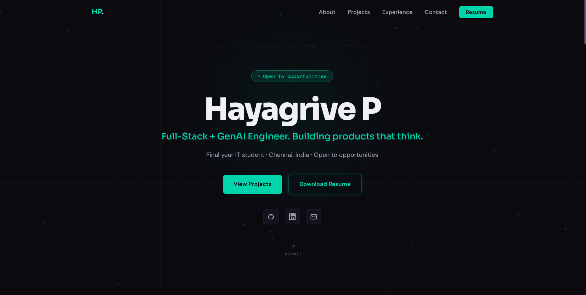
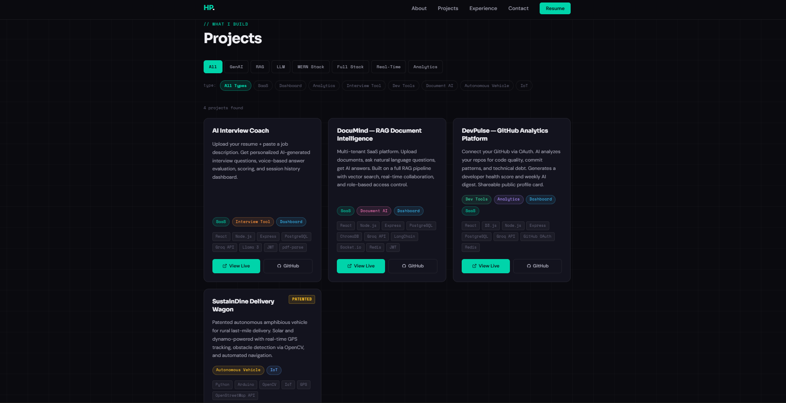

# Hayagrive P — Developer Portfolio

> A dark, space-themed portfolio website showcasing full-stack and AI engineering work — built to match the aesthetic of the projects it features.

**Live:** [https://portfolio-website-eight-fawn-48.vercel.app](https://portfolio-website-eight-fawn-48.vercel.app)



---

## Highlights

- **Custom dark / nebula design system** — CSS custom properties, no UI framework
- **Smooth scroll & section animations** via Framer Motion
- **Filterable projects grid** — tech-domain and project-type chips
- **Single-source-of-truth project data** — every card, badge, URL, and visibility flag lives in one config file
- **Upcoming projects section** for in-progress work (with patent and "private" badges)
- **Responsive across breakpoints** with mobile-first layout

---

## Tech Stack

| Layer | Technology |
|---|---|
| Framework | React 19 + Vite |
| Routing | React Router DOM v7 |
| Styling | Tailwind CSS v4 + custom CSS variables |
| Animation | Framer Motion |
| Icons | Lucide React |
| Deployment | Vercel (auto-deploy on `main`) |

---

## Project Structure

```
src/
├── components/
│   ├── Hero.jsx              # Landing section with name + tagline
│   ├── About.jsx
│   ├── Experience.jsx        # Timeline-style experience cards
│   ├── Projects.jsx          # Filter chips + grid renderer
│   ├── ProjectCard.jsx       # Individual project card (handles hide flags + badges)
│   ├── UpcomingProjects.jsx
│   └── Contact.jsx
├── data/
│   └── projects.js           # Single source of truth — all project metadata
└── App.jsx
```

---

## Adding or Editing a Project

All project metadata is in [`src/data/projects.js`](src/data/projects.js). To add a project:

```js
{
  title: "Your Project",
  description: "One-line pitch.",
  tech: ["React", "Node.js", "..."],
  liveUrl: "https://...",
  githubUrl: "https://github.com/...",
  hideLiveUrl: false,       // hide the "Live" button
  hideGithubUrl: false,     // hide the "GitHub" button
  badge: "Patented"         // optional pill badge
}
```

---

## Local Setup

```bash
npm install
npm run dev      # http://localhost:5173
npm run build    # production build (Vercel-ready)
npm run lint     # ESLint
```

---

## Screenshots

| Hero / Landing | Projects Grid |
|---|---|
|  |  |

---

## Author

**Hayagrive P** — Final-year B.Tech IT, Sri Sai Ram Institute of Technology
[Portfolio](https://portfolio-website-eight-fawn-48.vercel.app) · [LinkedIn](https://www.linkedin.com/in/hayagrive-p-619512257) · [GitHub](https://github.com/HayagriveP-official)
